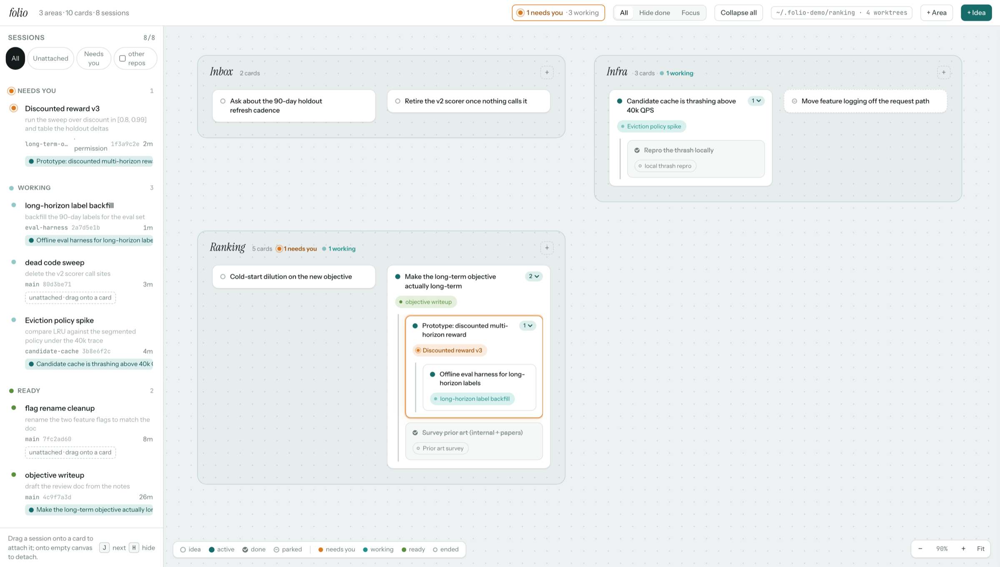
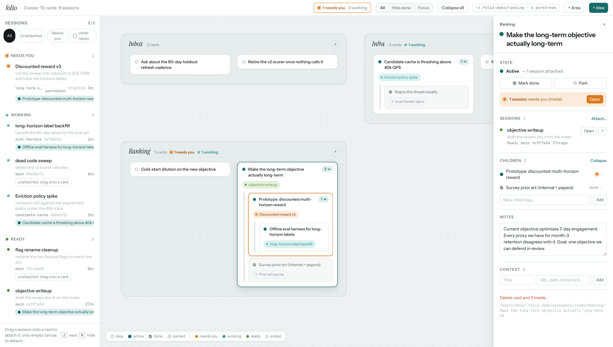

<h1 align="center">folio</h1>

<p align="center">
  <b>One board for every Claude Code session you have running.</b><br>
  See which one is blocked on you — and what piece of work it belongs to.
</p>

<p align="center">
  
  
  
  
  
</p>

<p align="center">
  
</p>

## Why

A Claude Code session is the unit of *interaction*. It is almost never the unit of
*work*. One real task spans a session to survey prior art, a fork that prototypes,
two more after the weekend, one compacted into uselessness, and a background session
still churning in a worktree you have forgotten the name of — while three unrelated
tasks run in adjacent terminal tabs. So you end up asking questions no tool answers:

- Which of my seven live sessions is **waiting on me** right now, versus still working?
- Which session was the one exploring the alternative approach?
- Where does *this* piece of work stand, five sessions later, now that every
  transcript is gone from my scrollback?

Terminal tabs cannot answer that. Neither can a task tracker, which knows nothing
about your sessions. folio joins the two halves.

## What you get

- **Nothing waits on you unnoticed.** Every session's coarse state — *working /
  needs you / ready / ended* — on one page. A permission prompt three levels deep in
  a background subagent still lights up the card at the top.
- **Work that outlives the session.** Sessions attach to a *card*; the card
  persists. Cards nest, so a prototype lives inside the investigation that spawned
  it.
- **Files you own.** Every card is one hand-editable Markdown file. Grep it, diff
  it, edit it in Obsidian while folio is running. No database, no cloud, no account.
- **A tool that cannot touch your agents.** folio only observes — see below.
- **Nothing to operate.** One Python process, two dependencies, ~3,400 lines,
  no build step.

<p align="center">
  
</p>

## Install

Requires Python 3.11+, git, and Claude Code.

```bash
git clone https://github.com/bo-hua/folio.git ~/code/folio && cd ~/code/folio
python3 -m venv .venv && .venv/bin/pip install -e .

.venv/bin/folio init --repo /path/to/your/git/repo   # writes ~/.cc-workspace/config.toml
.venv/bin/folio hooks install                        # then restart running Claude sessions
.venv/bin/folio serve                                # http://127.0.0.1:4317/
```

`folio hooks install` merges one observer hook into `~/.claude/settings.json`,
backing it up first and removing nothing. Use `--dry-run` to read the merge before
it happens, or `folio hooks print` to paste it by hand.

Cards appear as you create them; sessions appear in the left rail as the hook sees
them. `folio serve` refuses to bind anything but a loopback address.

## How it works

Two halves, joined on every request:

| | | |
|---|---|---|
| **Durable** | you own it | One Markdown file per card: name, status, notes, links, and the ids of the sessions that belong to it. Cards nest; they live in *areas*, which are just directories. |
| **Derived** | never stored | Session state from the hook. Worktrees and branches from `git worktree list`. Session titles from Claude Code's own transcript, so the rail says *"discounted reward sweep"* rather than `1f3a9c2e`. |

Nothing derived is written into your files, so nothing can go stale. Everything is
re-read per request — no cache, no index, fine for hundreds of cards.

The two kinds of state stay separate and are never merged: *idea / active / done /
parked* is what **you** decided; *needs you / working / ready / ended* is what
**Claude** is doing. "I parked this" and "a session on it is asking for permission"
are different facts.

## It observes. It never drives.

Claude Code pipes the hook one JSON event on stdin. It records coarse metadata,
exits 0, and **prints nothing** — so it cannot approve, deny, block, or alter a
permission decision.

It stores session ids, states, timestamps, cwd, permission mode, a best-effort pid,
and the *path* of the transcript. **Never** prompts, responses, tool arguments,
transcript contents, or code.

folio also never launches, steers, or kills a session. "Resume" hands you the right
shell command to copy. That boundary is deliberate: folio is safe to leave running
because there is nothing it can do to your agents.

## Using the board

One screen, three regions. You never position anything — you change *relations*,
and the app lays it out.

- **Sessions rail (left)** — every session the hook has seen, grouped by state.
  Drag a row onto a card to attach it; click to fly to it. Filter to *Unattached*
  (your inbox) or *Needs you*.
- **Canvas (centre)** — areas side by side, children nested inside their parent.
  Drag a card into another to make it a child, onto an edge to reorder, onto empty
  space to promote it. Attention glows amber and bubbles up; **J** walks you
  through it. Scroll pans, ⌘/ctrl-scroll zooms, **F** fits. A long list of
  children folds its done ones into a single *13 done* line at the bottom, so a
  parent that has collected finished work stays the height of what is still open;
  click the line to see them in place.
- **Inspector (right)** — rename, mark done or park, attached sessions with
  **Open / Resume**, children, notes (⌘-click a link in them to open it), context
  links, delete (cascades after a confirm).
- **Copy for Claude** — the copy button on a card (or **C** with a card open) puts
  the whole card on the clipboard as one block: name, id and file, notes, links,
  attached sessions with branch and last prompt, children, and the notes of every
  card above it. Type *work on this feature* in Claude Code and paste.

**H** cycles the focus filter: *All → Hide done → Focus* (only cards with a Claude
session attached: open cards with any session, ended or not, plus whatever a session
is live on right now). Hiding is by subtree, and a card whose session needs you is
never hidden — a filter that swallows an alert is worse than no filter.

Deep links are `/#card=<id>`; collapsed subtrees, opened done-folds, the camera and
the filter are remembered per browser.

Other commands: `folio worktrees`, `folio sessions [--all]`,
`folio hooks print|install|uninstall`, `folio tidy` (realign filenames that drifted
from card names).

## On a devbox over SSH

The intended setup: Claude Code, the repo, its worktrees and folio all on the
devbox; only a browser tab on your laptop.

```bash
# on the devbox
.venv/bin/folio serve --bind 127.0.0.1:4317

# on the laptop
ssh -L 4317:127.0.0.1:4317 devbox   # then open http://127.0.0.1:4317/
```

Nothing but loopback is ever exposed. Moving between machines is a `config.toml`
change.

## Docs

- [Data model](docs/data-model.md) — areas, cards, the item file format, where your data lives
- [The hook](docs/hook.md) — what is stored, event→state mapping, subagents, session titles
- [HTTP API](docs/api.md) — anything the UI does, a script can do
- [Architecture](docs/architecture.md) — module map, design rules, tests, limitations

## Not for you if…

folio is single-user, loopback-only, and tracks exactly one repository. It is not an
agent orchestrator, not a transcript viewer, not a team tracker, and it never syncs
anywhere. If that is what you want, folio is the wrong tool.
